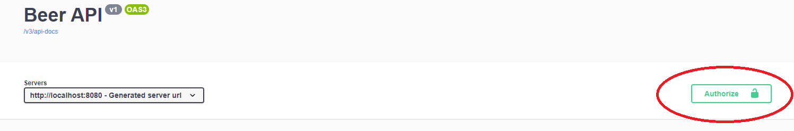

[![LinkedIn][linkedin-shield]][linkedin-url]


<!-- PROJECT LOGO -->
<br />
<div align="center">
  <a href="https://github.com/nKelidhs/beers-api">
    
  </a>

<h3 align="center">Beers</h3>

  <p align="center">
    Beers RESTful API
  </p>
</div>


<!-- TABLE OF CONTENTS -->
<details>
  <summary>Table of Contents</summary>
  <ol>
    <li>
      <a href="#about-the-project">About The Project</a>
      <ul>
        <li><a href="#built-with">Built With</a></li>
      </ul>
    </li>
    <li>
      <a href="#getting-started">Getting Started</a>
      <ul>
        <li><a href="#prerequisites">Prerequisites</a></li>
        <li><a href="#installation">Installation</a></li>
      </ul>
    </li>
    <li><a href="#testing">Usage</a></li>
    <li><a href="#contact">Contact</a></li>
  </ol>
</details>


<!-- ABOUT THE PROJECT -->
## About The Project

The API handles beers with the basic CRUD operations. It is build with Java using the Spring Boot Framework and uses PostgreSQL Database.
Lastly, JWT authentication is implemented.

This API was created as a job assignment.

<p align="right">(<a href="#top">back to top</a>)</p>


### Built With

* [Java](https://www.java.com/en/)
* [Spring Boot](https://spring.io/projects/spring-boot)
* [Lombok](https://projectlombok.org/)
* [JWT](https://jwt.io/)
* [Swagger-ui](https://springdoc.org/)
* [PostgreSQL](https://www.postgresql.org/)

<p align="right">(<a href="#top">back to top</a>)</p>


<!-- GETTING STARTED -->
## Getting Started

To get a local copy up and running follow these simple steps.

### Prerequisites

In order to run the API, PostgreSQL must be installed in the OS.

* [PostgreSQL](https://www.postgresql.org/download/)

### Installation

1. Clone the repo
   ```sh
   git clone https://github.com/nKelidhs/beers-api.git
   ```
2. Create the Database through bash or pgAdmin
   ```bash
   CREATE DATABASE database_name;
   ```
3. Enter your Postgre Database URL, Username and Password in `resources/application.properties`
   ```
   spring.datasource.url=jdbc:postgresql://localhost:PORT/database_name
   spring.datasource.username=username
   spring.datasource.password=password
   ```

<p align="right">(<a href="#top">back to top</a>)</p>


## Testing

Swagger was implemented in the API for testing purposes. For the Swagger please follow the link after you run the project: [Swagger UI](http://localhost:8080/swagger-ui/index.html#/) 

The API has JWT Authentication so before trying any request, a token must be generated using the default Username and Password (admin, admin).
To generate the token please follow this link: [Generate Token](http://localhost:8080/api/v1/token?username=admin&password=admin)

After that, the token must be provided to the Swagger UI using the following button:



<p align="right">(<a href="#top">back to top</a>)</p>


## Contact

Nikos Kelidis - [LinkedIn](https://www.linkedin.com/in/nkelidis1)- nkelidhs@gmail.com

Project Link: [https://github.com/nKelidhs/beers-api.git](https://github.com/nKelidhs/beers-api.git)

<p align="right">(<a href="#top">back to top</a>)</p>


<!-- MARKDOWN LINKS & IMAGES -->
<!-- https://www.markdownguide.org/basic-syntax/#reference-style-links -->
[linkedin-shield]: https://img.shields.io/badge/-LinkedIn-black.svg?style=for-the-badge&logo=linkedin&colorB=555
[linkedin-url]: https://www.linkedin.com/in/nkelidis1
